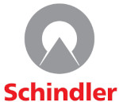
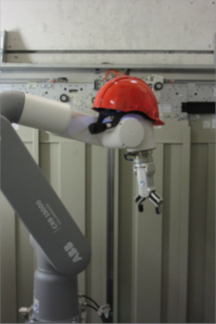
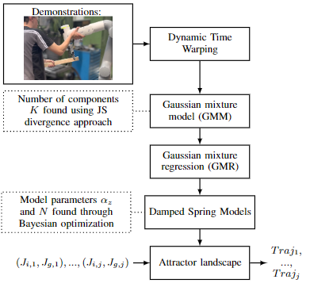

# TEAM: teach a robot arm to move

[](https://dev.azure.com/devsdb/CRD-NT_ARCO/_build/latest?definitionId=1211&repoName=SchindlerReGIS%2Fteam&branchName=main)







TEAM is a parameter-free algorithm to learn motions from user demonstrations.
This proposed method has been submitted to [ICRA2023](https://www.icra2023.org/) and the paper can be found on [arXiv](https://arxiv.org/abs/2209.06940).

If you use this work please cite:

```bib
@misc{https://doi.org/10.48550/arxiv.2209.06940,
  doi = {10.48550/ARXIV.2209.06940},
  url = {https://arxiv.org/abs/2209.06940},
  author = {Panchetti, Lorenzo and Zheng, Jianhao and Bouri, Mohamed and Mielle, Malcolm},
  title = {TEAM: a parameter-free algorithm to teach collaborative robots motions from user demonstrations},
  publisher = {arXiv},
  year = {2022},
  copyright = {arXiv.org perpetual, non-exclusive license}
  keywords = {Robotics (cs.RO), Systems and Control (eess.SY), FOS: Computer and information sciences, FOS: Computer and information sciences, FOS: Electrical engineering, electronic engineering, information engineering, FOS: Electrical engineering, electronic engineering, information engineering},
}
```

## License

Our objective is to share our results with the research community and produce reproducible science.
We wish that those who benefit from our work do the same :)!

Hence, this work is under the GNU AFFERO GENERAL PUBLIC LICENSE.
AGPL is a free/open source software license.
This doesn't mean the software is gratis; it means that you need to contact us as soon as you develop commercial activities distributing the software inside your product, or deploying it on a network without disclosing the source code of your own applications under the AGPL license.

These activities include:

* offering paid services to customers as an ASP.
* serving robot control on the fly in the cloud or in a web application.
* shipping _team_ with a closed source product.

If you would like to use this work under another LICENSE than this one, please contact us directly.

## Build and Test

1. Intall [rws2](https://github.com/SchindlerReGIS/rws2).
   It's the dependency needed to control an ABB robot for testing purpose.
2. Install [flit](https://github.com/pypa/flit) with `pip install flit`.
We use flit to package and install this repository.
3. Clone/fork the repo from Github.
4. Run `pip install -e .` in the root folder to install rws2 in editable mode (`pip install .` is enough if you do not plan to contribute).

The library should then be installed and you should be able to call it in python with `import team`.

## How to use the package

See `notebook/pipeline.ipynb`.

## Contribute

PR request on GitHub are welcome.
We use [black](https://github.com/psf/black) for code formatting and [flake8](https://github.com/pycqa/flake8) for linting.
Code that do not follow black formatting and follow flake8 linting will be rejected by the pipeline.

A standard git commit message consists of three parts, in order: a summary line, an optional bod.
The parts are separated by a single empty line.
The summary line is included in the short logs (git log --oneline, gitweb, Azure DevOps, email subject) and therefore should provide a short yet accurate description of the change.
The summary line is a short description of the most important changes. The summary line must not exceed 50 characters, and must not be wrapped. The summary should be in the imperative tense.
The body lines must not exceed 72 characters and can describe in more details what the commit does.
